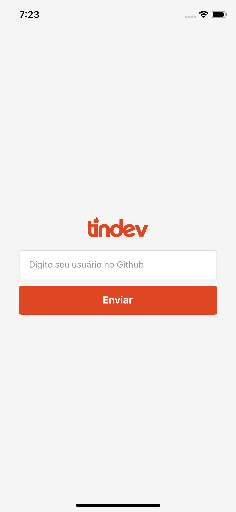
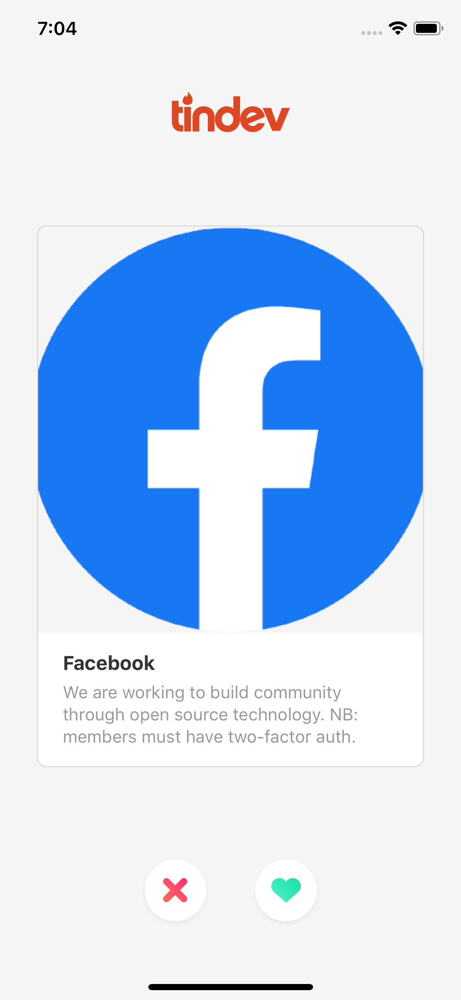
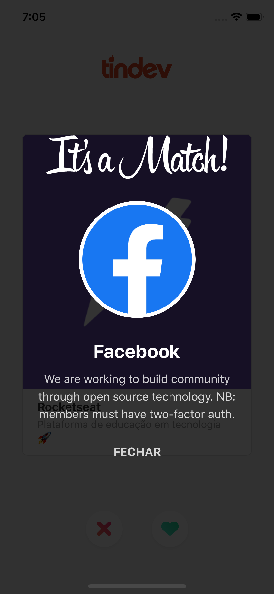
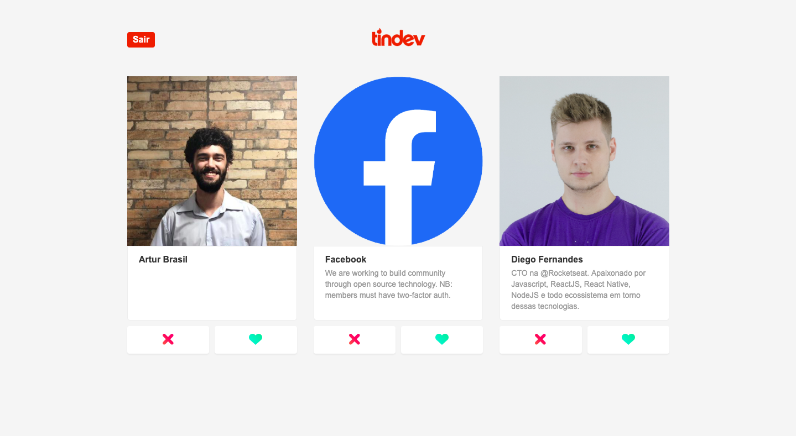
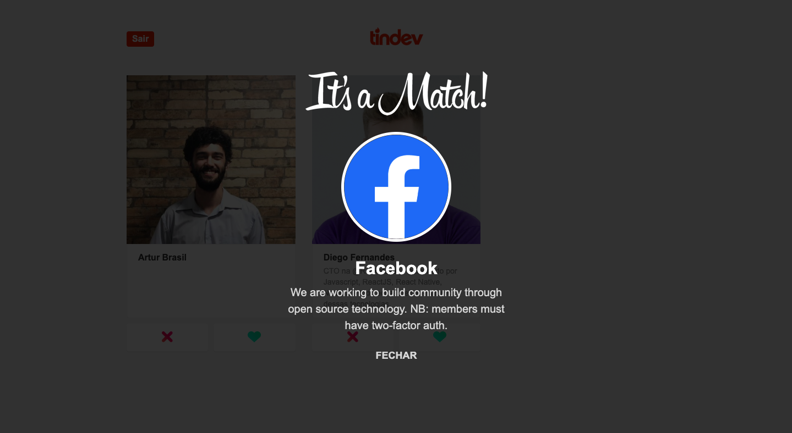

# Tindev
Aplicativo criado na Semana OmniStack 8.0 da @Rocketseat utilizando ```Node.js``` no backend, ```ReactJS``` no frontend e ```React Native``` no mobile.

## Screenshots
<p float="left">
  
  
  
</p>



